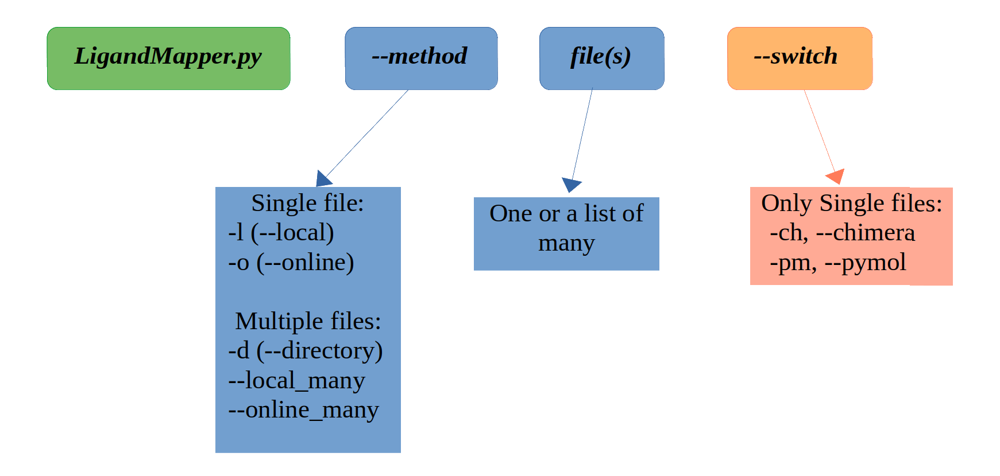

<div style="text-align: right;">

</div>

# Requirements

### OS: Linux or Mac

This is a standalone package, however it requires python3 and java to run. 

### Python3 check:
```
python3 --version
```
Should return something like: 
```
Python 3.x.y
```
(otherwise you will need to install it)

### Java check:
```
java --version
```
Should return something like: 
```
openjdk 11.0.18 2023-01-17
OpenJDK Runtime Environment (build 11.0.18+10-post-Ubuntu-0ubuntu122.04)
OpenJDK 64-Bit Server VM (build 11.0.18+10-post-Ubuntu-0ubuntu122.04, mixed mode, sharing)
```
(otherwise you will need to install it)

# Installation of LignadMapper.py

Once you have python3 and java on your machine, clone the repository or download it on your computer.

Change directory to the folder where you downloaded the zip:

```
cd {folder} 
```

Unzip file and enter folder:

``` 
unzip LigandMapper.py-main.zip

cd LigandMapper.py-main
```

And run:

```
python3 installMe.py 
```

During the installation you will be prompted to enter the password for sudo because the file needs to create a link in the /usr/bin/ folder.

After a successful installation you can remove the zip and the LigandMapper.py-main.zip directory. 

### Manual installation ( in case instalMe.py fails )

In case the installation fails:
1) You can run the program from the folder itself because it's already an executable with a python3 shebang.

2) And if you want it accessible to the command line as a command, then:
    * choose a directory from your $PATH (echo $PATH) - ex. /usr/bin/
    * create a symbolic link there (sudo ln -s ./LigandMapper/LigandMapper.py /usr/bin/)
    * then add add permissions to the whole package (sudo chmod -R 777 ./)
    * do not move or delete the folder!

    ```
    dir_path=$(find ~ -name 'LigandMapper' -type d)
    fileLM=$dir_path"/LigandMapper.py"
    sudo ln -s $fileLM /usr/bin/
    sudo chmod -R 777 ./
    ```
  
# Commands
Note: The ouput is to the standard error.
```
usage: LigandMapper.py [-h] [-l {file}.pdb] [-o {pdb_name}] [-d {direcory_name}] [--local_many [{file1}.pdb {file2}.pdb ...]] [--online_many [{pdb_name1} {pdb_name2} ...]] [-v] [-ch]
                       [-pm]

LigandMapper.py is a python script build to predict ligand binding sites of proteins from their .pdb files.

optional arguments:
  -h, --help            show this help message and exit
  -l {file}.pdb, --local {file}.pdb
                        One pdb local file.
  -o {pdb_name}, --online {pdb_name}
                        Get a pdb file from the pdb server and analyse that.
  -d {direcory_name}, --directory {direcory_name}
                        Analyse all files located in one local directory.
  --local_many [{file1}.pdb {file2}.pdb ...]
                        Analyse many local pdb files.
  --online_many [{pdb_name1} {pdb_name2} ...]
                        Get many pdb files from the pdb server and analyse them.
  -v, --verbose         Get more detailed output of the process to the standard error.
  -ch, --chimera        Open chimera immediately when file is ready to be visualised. Only applies to local and online SINGLE file.
  -pm, --pymol          Open pymol immediately when file is ready to be visualised. Only applies to local and online SINGLE file.
```
## Tutorials
Tutorials can be found 
<a href='https://formacio.bq.ub.edu/~u217733/LigandMapper/tutorials/tutorials.pdf'>
here
</a>.

## Examples

#### Local
* If you have one protein structure pdb file (ex. 1gln.pdb) on your computer and you want to predict the ligand binding pockets, run the --local (-l) method:
```
LigandMapper.py -l 1gln.pdb 
```

#### Online
* If you know whats the pdb name but you don't have the pdb file downloaded, you can automatically download it and run the analysis with the --online (-o) method:
```
LigandMapper.py -o 1gln
```

#### Directory
* If you have a directory of pdb files you want to analyse, run the --directory (-d) method:
```
LigandMapper.py -d directory_name/
```
* Or, my advice is, to run this once you have changed into the directory with the files (that way all the output will be stored in the same directory):
```
cd directory_name/
LigandMapper.py -d ./
```

#### Many local
* If you have many local files that you want to analyse, but they're not exclusively gropued in one directory, you can just list them with the --local_many method:
```
LigandMapper.py --local_many 1gln.pdb 2ew2.pdb subfol1/1gln.pdb  
```
#### Many online
* If you want to download from the pdb server and analyse many pdb files, list them with the --online_many method:
```
LigandMapper.py --online_many 1gn3 2ew2 1gln
```

### Visualisation:
* The output can directly visualised with the --chimera (-ch) and --pymol (-pm) switch, given that you have them installed on your computer, by including the switch when running the comand. Note: this only woks for the single-file methods (-l (--local) and -o (--online)); for the --directory, --online_many and --local_many you need to open the visualisation cmd files manually (see: *Output* below).

Ex. 
```
LigandMapper.py -l 1gln.pdb -ch
LigandMapper.py -o 1gln -pm
```

## General structure of the code
 

# Output

A prediction for a file ```{pdb}.pdb``` will create the following structure in the folder in which LigandMapper.py was executed. 

```
predict_{pdb}/
├── {pdb}.pdb_predictions.tsv
└── visualizations/
    ├── chimera_{pdb}.cmd
    ├── {pdb}.pdb.pml
    └── data/
        ├── {pdb}.pdb_points.pdb.gz
        └── {pdb}.pdb 
```

## TSV file:
The tsv file lists the predicted pockets in order of their score (probability, see 
<a href='https://formacio.bq.ub.edu/~u217733/LigandMapper/tutorials/theory.pdf'>*theoretical background*</a>
). Each pocket has the following attributes:

* rank 
* score	
* probability 
* sas_points - (int) number of solvent accessible surface points 
* surf_atoms - (int) integer of the number of surface atoms
* center_x - (float) the predicted pockets x center
* center_y - (float) the predicted pockets y center
* center_z - (float) the predicted pockets z center 
* residue_ids - (py dict) the residue sequence numbers that create the pocket { Chain : [ residue sequence numbers ] }
* residue_names - (py dict) the residue names that create the pocket { Chain : [ residue names ] }
* residue_types - (py dict) the character of the residues that create the pocket { Chain : [ characters ] }

    * 'N' represents non-polar amino acids
    * 'P' represents polar amino acids
    * '+' represents positively charged amino acids
    * '-' represents negatively charged amino acids
    * '0' a specific residue for which there is no info in the program

* surf_atom_ids - (py list) the atom serial number of all the atoms that are on the surface of the pocket

Information from the PDB is taken in this fashion:
| Columns | Data | Justification | Data Type |
| ------- | ---- | ------------- | --------- |
| 1-4 | "ATOM" | left | character |
| 7-11 | Atom serial number | right | integer |
| 13-16 | Atom name | left* | character |
| 17 | Alternate location indicator | - | character |
| 18-20 | Residue name | right | character |
| 22 | Chain identifier | - | character |
| 23-26 | Residue sequence number | right | integer |
| 27 | Code for insertions of residues | - | character |
| 31-38 | X orthogonal Angstrom coordinate | right | floating |
| 39-46 | Y orthogonal Angstrom coordinate | right | floating |
| 47-54 | Z orthogonal Angstrom coordinate | right | floating |
| 55-60 | Occupancy | right | floating |
| 61-66 | Temperature factor | right | floating |
| 73-76 | Segment identifier (optional) | left | character |
| 77-78 | Element symbol | right | character |
| 79-80 | Charge (optional) | - | character |


## Chimera CMD file

Has neccessary information to create the visualisations in chimera. The pockets are saved as selections titled "Pocket{NUM}" and colored untill the 18th pockets. 

The colors are ranked the same in all output, so it can be a visual aid for quick understanding of the pockets' rankings. This is true only for the Chimera file, not for the PyMol, because in PyMol the pockets and their colors can be easily viewed in the side panel.

| Color       | Rank |
|-------------|------|
| red         | 1    |
| orange      | 2    |
| yellow      | 3    |
| green       | 4    |
| cyan        | 5    |
| blue        | 6    |
| medium blue | 7    |
| purple      | 8    |
| hot pink    | 9    |
| magenta     | 10   |
| white       | 11   |
| gray        | 12   |
| black       | 13   |
| tan         | 14   |
| slate gray  | 15   |
| dark khaki  | 16   |
| plum        | 17   |
| rosy brown  | 18   |

run :
```
chimera {path}/predict_{pdb}/visualizations/chimera_{pdb}.cmd
```

## PyMol CMD file
In PyMol the pockets and their colors are conveniently displayed in the side panel.
run:
```
pymol {path}/predict_{pdb}/visualizations/{pdb}.pdb.pml
```

# References
This software is a lightweight version of <a href='https://github.com/rdk/p2rank'>p2rank</a>. 
* [Software article](https://doi.org/10.1186/s13321-018-0285-8) in JChem about P2Rank pocket prediction tool  
 Krivak R, Hoksza D. ***P2Rank: machine learning based tool for rapid and accurate prediction of ligand binding sites from protein structure.*** Journal of Cheminformatics. 2018 Aug.
* [Conference paper](https://doi.org/10.1007/978-3-319-21233-3_4) introducing P2Rank prediction algorithm  
 Krivak R, Hoksza D. ***P2RANK: Knowledge-Based Ligand Binding Site Prediction Using Aggregated Local Features.*** International Conference on Algorithms for Computational Biology 2015 Aug 4 (pp. 41-52). Springer
* [Research article](https://doi.org/10.1186/s13321-015-0059-5) in JChem about PRANK rescoring algorithm  
 Krivak R, Hoksza D. ***Improving protein-ligand binding site prediction accuracy by classification of inner pocket points using local features.*** Journal of Cheminformatics. 2015 Dec.

